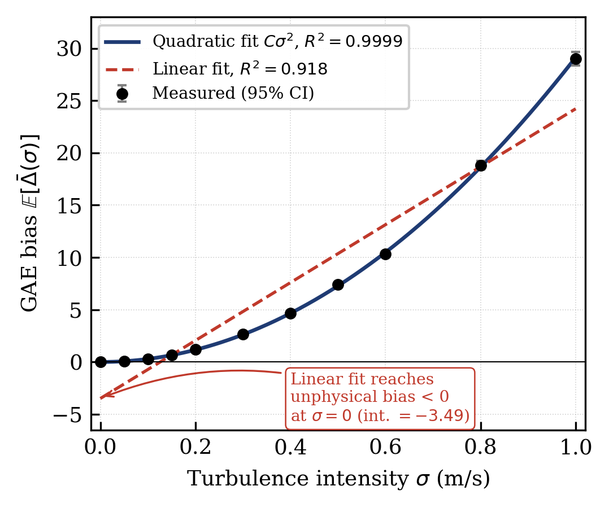
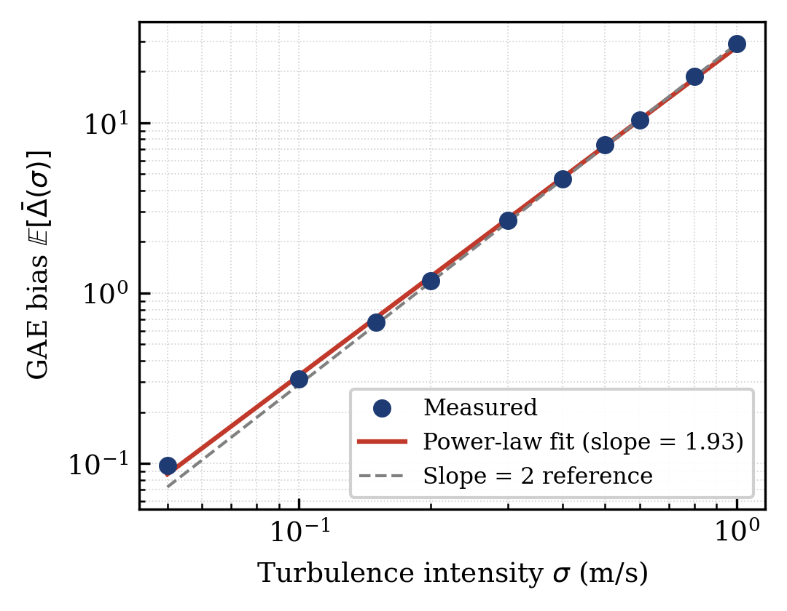
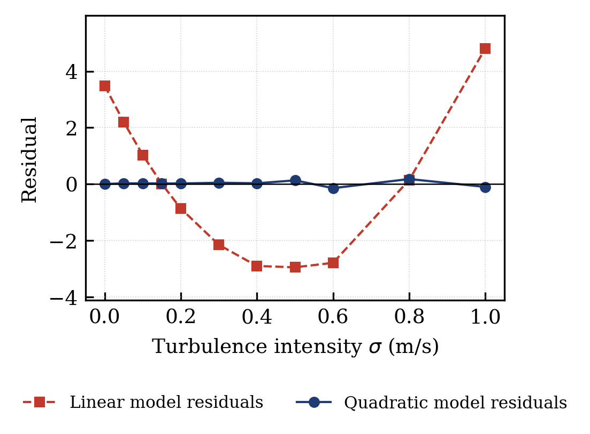

# Quadratic Degradation of PPO Advantage Estimates Under Aerodynamic Disturbances

Reproduction code for the paper:

> **A Quadratic Bound on PPO Advantage Bias Under UAV Turbulence**
> Sahil Patil, Nasiruddin Kabir — Dept. of Aerospace Engineering, IIT Bombay

This repository contains a fully self-contained NumPy/SciPy experiment that
measures how the Generalized Advantage Estimation (GAE) bias of a PPO-style
critic degrades as the intensity $\sigma$ of an aerodynamic crosswind
disturbance increases. The headline result is that the bias grows
**quadratically** in $\sigma$ — a direct consequence of pairing a quadratic
(LQR) value function with a zero-mean disturbance — and the experiment
confirms this with $R^2 = 0.9999$ and a fitted power-law exponent of $1.93$.

---

## Key result

The measured GAE bias follows $\;\mathbb{E}[\bar{\Delta}(\sigma)] = 29.13\,\sigma^2\;$
across eleven disturbance levels and 33,000 Monte-Carlo trial pairs.



A linear-in-$\sigma$ model ($R^2 = 0.918$) is mis-specified: it overshoots at
mid-range $\sigma$ and extrapolates to an unphysical negative bias at
$\sigma = 0$. The quadratic model ($R^2 = 0.9999$) tracks the data everywhere.

The log–log plot gives a fit-independent confirmation of the exponent: a power
law $\sigma^p$ is a straight line of slope $p$, and the measured slope is
$1.93$, matching the slope-2 reference.



The residuals make the model comparison explicit — the linear model leaves a
systematic U-shaped residual pattern, while the quadratic residuals are small
and unstructured.



---

## Repository contents

| File | Description |
|------|-------------|
| `run_experiment.py` | Main experiment: solves the DARE, runs the Monte-Carlo trials, fits the quadratic model, computes the critical threshold, and writes the output files. |
| `make_plots.py` | Generates the three figures above from the experiment data. |
| `paper_corrected.tex` | LaTeX source of the paper (IEEEtran conference format). |
| `figures/` | Pre-rendered figures (`.png`). |
| `requirements.txt` | Python dependencies. |

Running the code also produces three output files:

- `results_table.csv` — Table I in the paper
- `regression_stats.txt` — regression statistics ($C_{\text{emp}}$, $R^2$, exponent, etc.)
- `critical_threshold.txt` — critical disturbance thresholds $\sigma^*(f)$

---

## Requirements

- Python 3.10+
- NumPy
- SciPy
- Matplotlib (only needed for `make_plots.py`)

Install everything with:

```bash
pip install -r requirements.txt
```

---

## How to run

**1. Reproduce the numerical results** (seed 0, as in the paper):

```bash
python run_experiment.py
```

This prints progress to the console and writes `results_table.csv`,
`regression_stats.txt`, and `critical_threshold.txt`. It runs in well under an
hour on a standard laptop CPU; no GPU is required.

You can change the configuration via command-line flags:

```bash
python run_experiment.py --seed 0 --n_trials 3000 --T 20 --gamma 0.99 --lam 0.95
```

| Flag | Default | Meaning |
|------|---------|---------|
| `--seed` | `0` | Random seed |
| `--n_trials` | `3000` | Monte-Carlo trial pairs per $\sigma$ level |
| `--T` | `20` | Rollout length (steps) |
| `--dt` | `0.1` | Timestep (seconds) |
| `--gamma` | `0.99` | Discount factor |
| `--lam` | `0.95` | GAE decay parameter $\lambda$ |

**2. Regenerate the figures:**

```bash
python make_plots.py
```

This writes `fig_mainfit.pdf`, `fig_loglog.pdf`, and `fig_residuals.pdf`
(300 dpi, IEEE single-column width).

---

## Expected output

With the default settings you should obtain:

```
Quadratic model: E[DeltaA] = 29.13 * sigma^2
R^2 (through origin) = 0.9999
log-log exponent     = 1.93
p-value              = 1.51e-19
C_emp / C_theo       = 2.4e-3   (bound valid but conservative)

Critical thresholds:
  sigma*(f=10%) = 0.023 m/s
  sigma*(f=25%) = 0.037 m/s
```

The Riccati matrix has spectral norm $\|P\|_2 = 14.378$ and the LQR
closed-loop spectral radius is $0.904$ (asymptotically stable). The DARE
recursion converges to tolerance $10^{-12}$ in 141 iterations.

---

## Citation

If you use this code, please cite the paper:

```bibtex
@article{patil2026quadratic,
  title   = {A Quadratic Bound on PPO Advantage Bias Under UAV Turbulence},
  author  = {Patil, Sahil and Kabir, Nasiruddin},
  journal = {International Journal of Engineering Research \& Technology (IJERT)},
  volume  = {15},
  number  = {05},
  year    = {2026}
}
```

---

## License

Released under the MIT License. See `LICENSE` for details.
